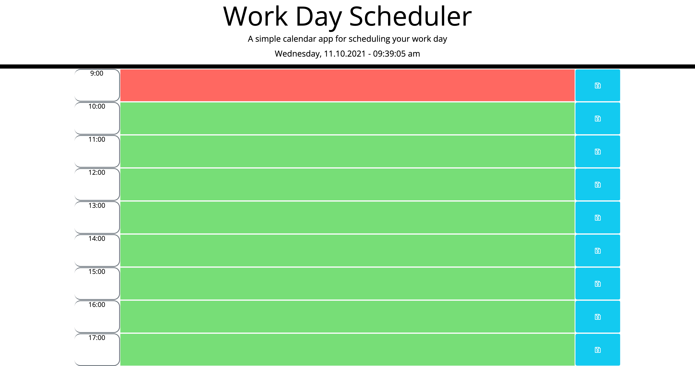

# Work Day Scheduler

## Description

This is a simple daily work planner using third party apis - bootstrap, fontAwesome, Google Fonts, jQuery, and Moment to help with functionality. This daily planner will allow the user to set events, which are saved to localStorage, and task columns to change color based on the time of day. If the event has past, the column will be grey; if current, the column will be red; if in the future, the column will be green.

## Table of Contents

- [Links](#links)
- [Usages](#usages)
- [Acceptance Criteria](#acceptance-criteria)
- [Contribution](#contribution)

## Links

[Live page](https://a-breezy.github.io/Work-Day-Scheduler/)
[GitHub Repo](https://github.com/a-breezy/Work-Day-Scheduler)

## Usages

## Resources (APIs)

- [Bootstrap](https://getbootstrap.com/)
- [fontAwesome](https://fontawesome.com/)
- [Google Fonts](https://fonts.google.com/)
- [jQuery](https://jquery.com/)
- [Moment](https://momentjs.com/docs/)

## Acceptance Criteria

GIVEN I am using a daily planner to create a schedule
WHEN I open the planner
THEN the current day is displayed at the top of the calendar
WHEN I scroll down
THEN I am presented with timeblocks for standard business hours
WHEN I view the timeblocks for that day
THEN each timeblock is color coded to indicate whether it is in the past, present, or future
WHEN I click into a timeblock
THEN I can enter an event
WHEN I click the save button for that timeblock
THEN the text for that event is saved in local storage
WHEN I refresh the page
THEN the saved events persist

## Contribution

Made with ❤️ by a-breezy
Logical help from @andrewyu22
